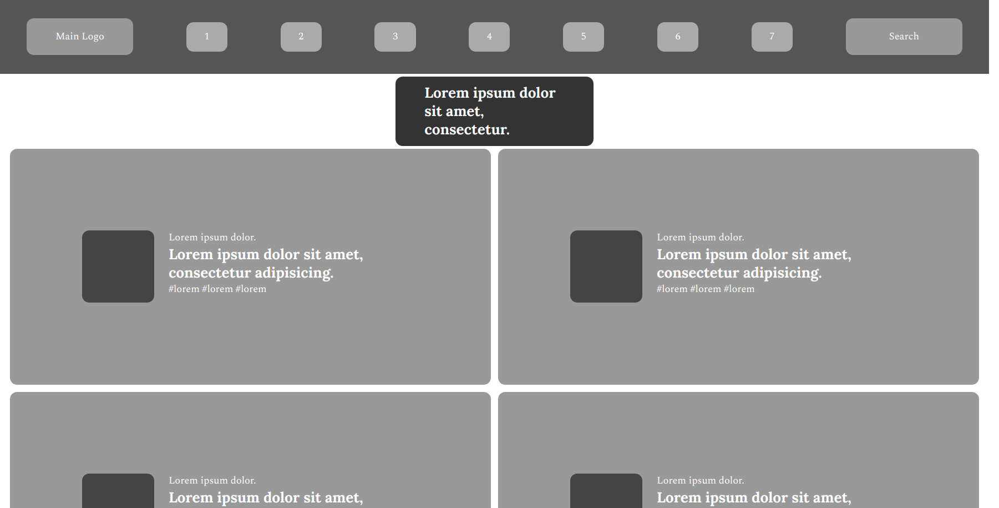

# Design Teardown

> Create a grayscale heatmap of the Smashing Magazine

The project tries to analyse the original webpage of the "Smashing Magazine".
It uses the concept of the visual hierarchy to differentiate between different elements present on the webpage.

## Built With

- HTML
- CSS
- Google Web Fonts

## Live Demo

[Live Demo Link](https://newhorizon-tech.github.io/design-teardown/)

## Authors

👤 **Meron Ogbai**

- Github: [@meronokbay](https://github.com/meronokbay)
- Twitter: [@MeronDev](https://twitter.com/MeronDev)
- Linkedin: [linkedin](https://linkedin.com/in/meron-ogbai-467414198/)

👤 **Alaukik**

- Github: [@newhorizon-tech](https://github.com/newhorizon-tech)
- Twitter: [@techintosh3](https://twitter.com/techintosh3)

## 🤝 Contributing

Contributions, issues and feature requests are welcome!

Feel free to check the [issues page](issues/).

## Show your support

Give a ⭐️ if you like this project!
